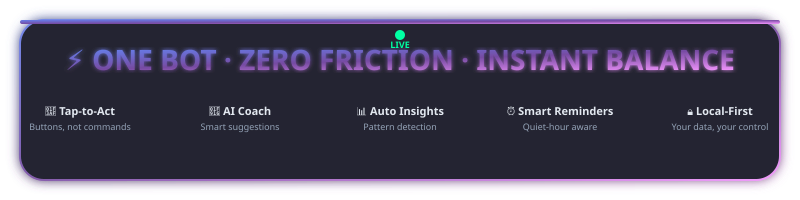
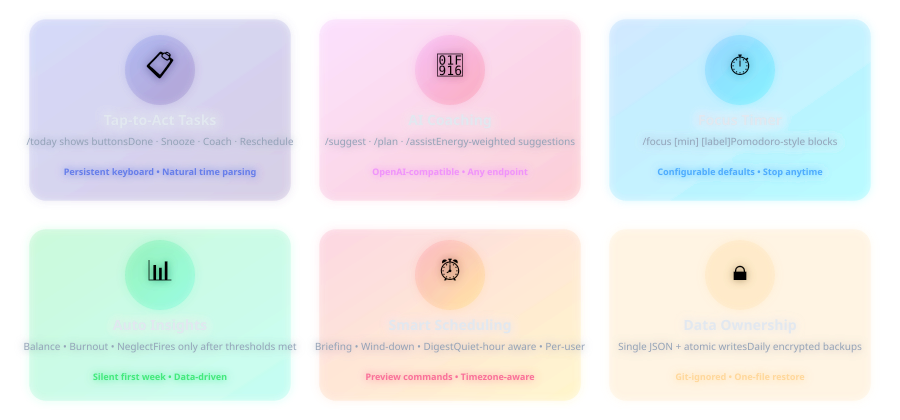
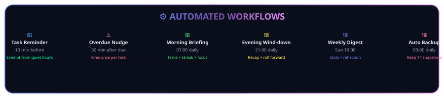
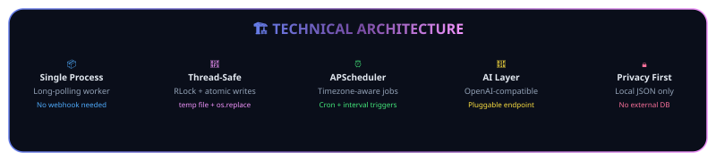

<div align="center">
  
  <h1>🌿 LifeBalance Bot</h1>
  <p><strong>Tap, don't type. Balance work & life effortlessly.</strong></p>
  <p>Your intelligent Telegram companion for task management, focus sessions, AI coaching & life insights.</p>
</div>


<div align="center">
  
[](https://python.org)
[](https://github.com/python-telegram-bot/python-telegram-bot)
[](https://apscheduler.readthedocs.io)
[](https://railway.app)
[](LICENSE)
[](https://github.com/printezy247/lifebalance-bot/stargazers)
[](https://github.com/printezy247/lifebalance-bot/network/members)
[](https://github.com/printezy247/lifebalance-bot/issues)

</div>

---

## ✨ The Promise

<div align="center">
  
</div>

---

## 🚀 Quick Start

### Zero-Config Deploy (Railway)

```bash
# 1. Fork this repo
# 2. New Project → Deploy from GitHub → Select lifebalance-bot
# 3. Add Volume: mount path /data
# 4. Set env vars (see below)
# 5. Deploy → Done!
```

**Required:** `BOT_TOKEN` (from [@BotFather](https://t.me/BotFather))  
**Strongly recommended:** `DATA_DIR=/data`, `BOT_TZ=Asia/Kuala_Lumpur`  
**Optional AI:** `HF_TOKEN`, `AI_MODEL=meta-llama/Llama-3.1-8B-Instruct`

<details>
<summary><strong>📋 Full Environment Variables</strong></summary>

| Variable | Default | Description |
|---|---|---|
| `BOT_TOKEN` | *required* | Telegram bot token |
| `DATA_DIR` | `.` | **Must be a mounted volume** for persistence |
| `BOT_TZ` | `UTC` | IANA timezone (e.g. `Asia/Kuala_Lumpur`) |
| `HF_TOKEN` | — | HuggingFace token for AI features |
| `AI_MODEL` | `meta-llama/Llama-3.1-8B-Instruct` | OpenAI-compatible model |
| `AI_BASE_URL` | `https://router.huggingface.co/v1/chat/completions` | API endpoint |
| `AI_TIMEOUT` | `45` | Request timeout (seconds) |
| `QUIET_START` / `QUIET_END` | `22` / `7` | Quiet hours (0-23, equal = disabled) |
| `BRIEFING_ENABLED` / `BRIEFING_HOUR` | `1` / `7` | Morning briefing toggle & hour |
| `WINDDOWN_ENABLED` / `WINDDOWN_HOUR` | `1` / `21` | Evening wind-down toggle & hour |
| `DIGEST_ENABLED` / `DIGEST_DAY` / `DIGEST_HOUR` | `1` / `0` / `19` | Weekly digest (Day 0=Sunday) |
| `NUDGE_ENABLED` / `NUDGE_AFTER_MINUTES` | `1` / `30` | Overdue nudges |
| `BACKUP_ENABLED` / `BACKUP_HOUR` / `BACKUP_KEEP` | `1` / `3` / `14` | Daily backups, retention |
| `FOCUS_DEFAULT` / `FOCUS_MAX` | `25` / `180` | Focus timer defaults (minutes) |

</details>

---

## ⚡ Core Features

<div align="center">
  
</div>

---

## 📋 Command Reference

<details open>
<summary><strong>🎯 Basics</strong></summary>

| Command | Description |
|---|---|
| `/start` | Welcome + persistent keyboard |
| `/help` | All commands, schedule, timezone |

</details>

<details>
<summary><strong>📝 Tasks</strong></summary>

| Command | Description | Example |
|---|---|---|
| `/add <task> <time> [cat]` | Add task | `/add Call mom 3:30pm family` |
| `/today` | Today's tasks as buttons | — |
| `/week` | Weekly progress bars + streak | — |
| `/done <id>` | Complete + rate energy 1-5 | `/done 3` |
| `/snooze <id>` | Delay 30 minutes | `/snooze 3` |
| `/reschedule <id> <time>` | Move task | `/reschedule 3 tomorrow 9am` |

**Time formats:** `3pm`, `3:30pm`, `15:00`, `tomorrow`, `tomorrow 9am`  
**Categories:** `family` `trading` `marketing` `content` `learning` `health` `admin` `general`

</details>

<details>
<summary><strong>⏱️ Focus</strong></summary>

| Command | Description |
|---|---|
| `/focus` | Start timer (default minutes) |
| `/focus 50` | 50-minute block |
| `/focus 50 deep work` | Timer with label |
| `/focus stop` | Cancel running timer |

</details>

<details>
<summary><strong>🤖 AI</strong></summary>

| Command | Description |
|---|---|
| `/suggest` | Task suggestion (energy-weighted) |
| `/ai_suggest` | Alias for backwards compat |
| `/plan <goal> [cat]` | Break goal into subtasks |
| `/assist <id>` | Coaching tip for task |

</details>

<details>
<summary><strong>🧠 Reflection & Settings</strong></summary>

| Command | Description |
|---|---|
| `/reflect` | Guided reflection prompt |
| `/settings` | Toggle automations, quiet hours |
| `/brief` | Preview morning briefing |
| `/winddown` | Preview evening wind-down |
| `/digest` | Preview weekly digest |

</details>

---

## 🔄 Automations

<div align="center">
  
</div>

---

## 🧠 Insight Engine

| Insight | Trigger Condition | Action |
|---|---|---|
| **⚖️ Balance** | 8 tasks in 14 days, one category > 60% | Suggests diversification |
| **🔥 Burnout** | 4 energy ratings in 7 days, avg < 2.5 | Recommends rest / lighter load |
| **👁️ Neglect** | Watched category silent 10+ days | Gentle nudge to revisit |

> **Note:** Insights stay silent during the first week on fresh installs — this is intentional. The bot learns your patterns before speaking up.

---

## 🛠️ Local Development

```bash
# 1. Clone & enter
git clone https://github.com/printezy247/lifebalance-bot.git
cd lifebalance-bot

# 2. Virtual environment
python -m venv .venv
.venv\Scripts\activate        # Windows
source .venv/bin/activate      # macOS/Linux

# 3. Install deps
pip install -r requirements.txt

# 4. Create .env (git-ignored)
cat > .env << 'EOF'
BOT_TOKEN=your_token_from_botfather
BOT_TZ=Asia/Kuala_Lumpur
DATA_DIR=./local-data
HF_TOKEN=your_hf_token_optional
EOF

# 5. Run
python lifebalance_bot.py
```

> ⚠️ Only one instance may poll a given bot token. Stop Railway service or use a second token for local dev.

---

## 📦 Project Structure

```
lifebalance-bot/
├── lifebalance_bot.py      # Main entry point (long-polling worker)
├── requirements.txt        # Pinned minimal deps
├── Procfile                # Railway: worker: python lifebalance_bot.py
├── .python-version         # Pinned Python 3.11
├── .gitignore              # Ignores data/, backups/, .env, __pycache__
├── LICENSE                 # MIT
└── README.md               # You are here
```

**Runtime files (git-ignored, created at runtime):**
```
data/
├── user_data.json          # Single atomic JSON store
└── backups/
    ├── user_data_20260911_030000.json
    └── ...
```

---

## 🏗️ Architecture Highlights

<div align="center">
  
</div>

---

## 🐛 Troubleshooting

| Symptom | Likely Cause | Fix |
|---|---|---|
| Tasks vanish after deploy | `DATA_DIR` unset / no volume | Attach volume at `/data`, set `DATA_DIR=/data` |
| Reminders at wrong hour | `BOT_TZ` unset | Set IANA timezone (e.g. `Asia/Kuala_Lumpur`) |
| Briefing/digest never arrives | Inside quiet hours or toggled off | Check `/settings` or adjust schedule |
| `AI unavailable - token missing` | `HF_TOKEN` lacks Inference permission | Enable **Inference Providers** in HF settings |
| `AI unavailable - out of credits` | Free tier exhausted | Resets monthly or add credits |
| `model '...' not served` | Model unavailable | Change `AI_MODEL` |
| Connection errors | `AI_BASE_URL` wrong | Verify endpoint URL |
| Nudges silent at night | Working as designed | Quiet hours exempt reminders only |
| Insights never appear | Below data thresholds | Wait for enough history |

---

## 📝 Maintainer Notes

- **Don't pin** `httpx`, `httpcore`, `anyio` — PTB manages compatible versions
- Python version pinned in `.python-version` — leave unpinned at your own risk
- `tzdata` required (zoneinfo lacks tz DB on slim Linux images)
- Jobs must not hold data across `await` — `load_data`/`save_data` are sync
- Callback data limited to 64 bytes — use namespaces (`t:`, `nav:`, `dash:`)
- **HTML-escape all user text** before insertion — otherwise Telegram rejects
- PTB schedule mapping: Sunday-Saturday (v20+) — use explicit `tzinfo`

---

## 🤝 Contributing

1. Fork the repo
2. Create a feature branch: `git checkout -b feat/amazing-feature`
3. Commit changes: `git commit -m 'Add amazing feature'`
4. Push to branch: `git push origin feat/amazing-feature`
5. Open a Pull Request

---

## 📄 License

MIT License — see [LICENSE](LICENSE) for details.

---

<div align="center">
  
  <br><br>
  <sub>Educational & personal productivity tool. Not professional advice.</sub>
</div>